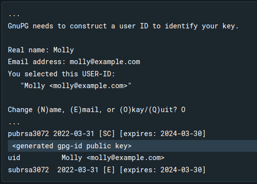

- If you are facing issue while signing in docker desktop then run docker login in ur terminal 
- then ``` gpg --full-generate-key ```
- select 1(RSA and RSA (default))
- then enter then 0 then y then give your Name, Email, Comment (docker) then ok. And set your password
- then copy ur gpg-id public key   or run this command to get the public-key ```gpg --list-keys```.

- then ```pass init <your_generated_gpg-id_public_key>```

- again ```docker login``` give uy credentials and password. And open docker desktop

# Error 40:43
- ```docker run -p 5173:5173 -v "$(pwd):/app" -v /app/node_modules react-docker ```  This command is giving error.  

``` 
failed to load config from /app/vite.config.ts
error when starting dev server:
Error: EACCES: permission denied, open '/app/vite.config.ts.timestamp-1719833881866-5f04cee956eec.mjs'
    at async open (node:internal/fs/promises:639:25)
    at async Object.writeFile (node:internal/fs/promises:1219:14)
    at async loadConfigFromBundledFile (file:///app/node_modules/vite/dist/node/chunks/dep-C1-ZB6nQ.js:66977:5)
    at async loadConfigFromFile (file:///app/node_modules/vite/dist/node/chunks/dep-C1-ZB6nQ.js:66820:24)
    at async resolveConfig (file:///app/node_modules/vite/dist/node/chunks/dep-C1-ZB6nQ.js:66430:24)
    at async _createServer (file:///app/node_modules/vite/dist/node/chunks/dep-C1-ZB6nQ.js:63043:18)
    at async CAC.<anonymous> (file:///app/node_modules/vite/dist/node/cli.js:735:20) 
```


